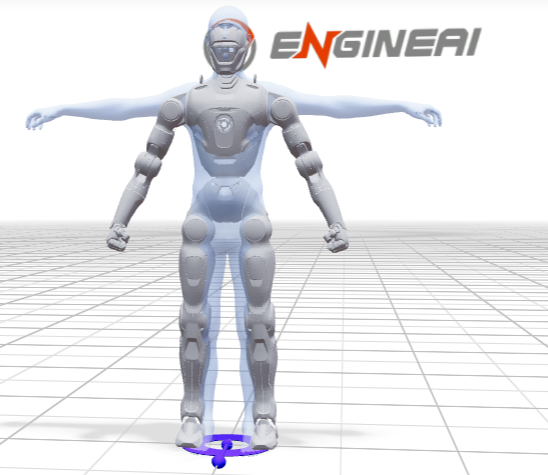

# EngineAI Studio Pro



Kimodo demo on **Linux + NVIDIA GPU**: text-to-motion generation, NF4 text encoder ([matbee/kimodo-llm2vec-nf4](https://huggingface.co/matbee/kimodo-llm2vec-nf4)), optional retargeting to the **EngineAI T800** humanoid.

**Model weights are not in the repository** — download them with the scripts below after cloning.

## Quick start

```bash
git clone https://github.com/nbamylife7-bot/engineAI-studio-pro.git
cd engineAI-studio-pro

sudo ./install_system_deps.sh    # once per machine
./install.sh
source ./activate_cuda.sh
./scripts/verify_gpu_setup.sh

./download_nf4.sh
hf auth login                     # only for nvidia/Kimodo-*
./scripts/download_kimodo_models.sh

./run_demo.sh                     # http://127.0.0.1:7860
```

Full step-by-step setup, WSL2, RTX 50xx cards, and common errors — **[docs/INSTALL.md](docs/INSTALL.md)**.

## Hardware

**Tested on:** NVIDIA **RTX 50xx** (Blackwell), **12 GB VRAM**, Linux / WSL2.

**VRAM in practice:** single-process `run_demo.sh` (NF4 encoder + diffusion) uses about **7–7.5 GB** on GPU. It may work on **8 GB** cards in theory, but that has not been fully validated — leave headroom or use the two-process split below.

- **12 GB** — comfortable for `./run_demo.sh` (one process)
- **~8 GB** — try `./run_demo.sh` first; if OOM, use `./run_textencoder.sh` + `./run_demo_api.sh` (see [docs/INSTALL.md](docs/INSTALL.md))
- **16 GB+** — same as 12 GB, more margin for multi-sample / T800
- Ubuntu 22.04/24.04 or Debian 12, x86_64 (**WSL2** works)
- ~40–50 GB disk (conda, PyTorch, models)
- 16 GB system RAM

## In git vs downloaded after clone

| In the repository | Downloaded after clone |
|-------------------|-------------------------|
| `kimodo/` — Kimodo code (CUDA/NF4) | — |
| `web-version/gmr/` — T800, robot meshes | SMPL-X body models (license) |
| `install.sh`, `run_*.sh`, `docs/` | NF4 ~5 GB (`download_nf4.sh`) |
| | diffusion ~1.1 GB per model (`scripts/download_kimodo_models.sh`) |
| | conda env via `install.sh` |

## More docs

- [docs/INSTALL.md](docs/INSTALL.md) — main installation guide
- [docs/GPU.md](docs/GPU.md) — GPU vs CPU, environment variables
- [docs/MAINTAINER.md](docs/MAINTAINER.md) — publishing to GitHub
- `.env.example` — optional environment overrides

## Publish to GitHub

```bash
cp .env.github.example .env.github   # set GITHUB_USER and GITHUB_TOKEN
./scripts/publish_to_github.sh
```

Do not commit `.env.github` (it is gitignored).

## Licenses

Kimodo code — Apache 2.0 (see `kimodo/LICENSE` and `LICENSE`). NVIDIA / Meta / matbee models — Hugging Face terms. SMPL-X requires separate registration on the SMPL-X website.
